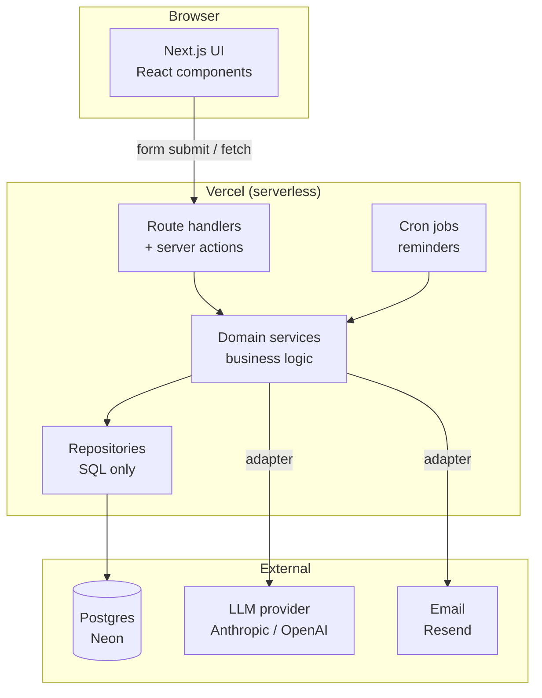
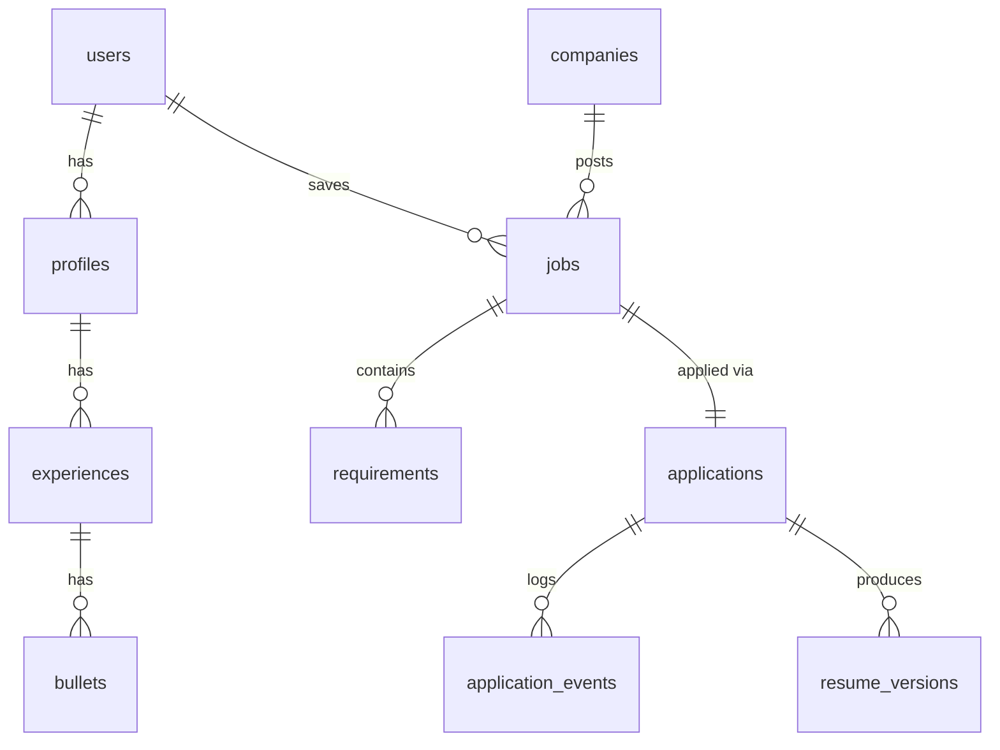

# jobtrail — Architecture

> A job-hunt copilot. Paste a job description, get the real requirements extracted,
> see how your profile matches, generate tailored resume bullets, and track the
> application through to an outcome.

This document is the target design. It is **not** what gets built on day one — see
[Build order](#9-build-order) for what actually happens when. Everything here is a
decision with a reason attached; when a reason stops being true, change the decision.

---

## 1. Design principles

These are the rules the rest of the document follows. When something below looks
arbitrary, it's one of these.

1. **Domain first, framework second.** Folder names come from the problem (`applications`,
   `requirements`, `tailoring`), not from the tooling (`hooks`, `helpers`, `services`).
2. **Group by feature, not by file type.** A feature owns its UI, its logic, its data
   access and its types, together in one folder.
3. **Layers, strictly ordered.** `route/page → action → service → repository → db`.
   No layer skips the next one. A page never writes SQL; a repository never calls an LLM.
4. **All I/O behind an adapter.** Database, LLM provider, email. One file each. Swapping
   Anthropic for OpenAI, or Neon for Supabase, should touch one file.
5. **Secrets never reach the browser.** Every AI and database call happens on the server.
   This is not a preference, it's the whole reason the app has a backend.
6. **Reversible over correct.** You don't know the final schema. Put every query behind a
   repository function so changing your mind costs one file, not forty.
7. **Nothing speculative.** No folder exists until something goes in it.

---

## 2. High-level design

### 2.1 Context

Single user at first (you), designed so multi-user is a change of `WHERE` clauses rather
than a rewrite. Every table that holds user data carries a `user_id` from day one, even
while there is only one user.

### 2.2 Components



**Why serverless functions rather than a long-running server:** Vercel's free tier, zero
ops, and every request in this app is short and independent. The cost is cold starts and
no in-memory state between requests — neither matters here. If you later need a long-lived
worker (embedding a large backlog, say), that becomes a separate service; the design
doesn't have to change to accommodate it.

### 2.3 The four core flows

**Flow A — ingest a job description**

```
paste JD  →  POST /api/jobs
          →  jobService.createFromRawJD()
          →  ai.extractRequirements(rawJd)      [LLM, structured JSON out]
          →  jobRepo.insertJob() + requirementRepo.insertMany()
          →  return job with parsed requirements
```

The LLM's job here is narrow and checkable: turn prose into a list of
`{ text, kind: 'must' | 'nice', skill, weight }`. Narrow tasks with schema-shaped output
are the ones LLMs do reliably.

**Flow B — score the match**

```
job requirements  ─┐
                   ├→ matchService.score()  →  per-requirement verdict + overall score
your profile bullets ┘
```

Phase 1 is keyword/skill overlap — dumb, fast, and a baseline you can measure against.
Phase 2 replaces it with embedding similarity over `bullets.embedding` and
`requirements.embedding`. Keeping the baseline is the point: without it you can't tell
whether the fancier version is actually better.

**Flow C — tailor the resume**

```
job + matched bullets  →  ai.tailorBullets()  →  resume_versions row (JSON)
```

Every generation is stored as a version tied to that application. You never lose what you
actually sent, which matters when someone calls you about an application from six weeks ago.

**Flow D — track and remind**

```
status change  →  applications.status updated + application_events row appended
daily cron     →  find applications with next_action_at <= today  →  email / dashboard
```

Status lives on the application (fast to query); the *history* lives in an append-only
events table. That split is worth internalising — it's how most real systems handle
"current value plus audit trail."

### 2.4 Non-functional decisions

| Concern | Decision | Reason |
|---|---|---|
| Secrets | Server-only env vars, validated at boot in `config/env.ts` | A leaked key on a public repo is the single most common junior mistake |
| LLM cost | Cache extraction by hash of the raw JD; never re-extract the same text | JDs get pasted twice constantly |
| Observability | Log every LLM call to an `ai_calls` table: model, tokens, latency, cost | You cannot tune what you don't measure, and it's a strong interview talking point |
| Correctness | A small eval set of JDs with hand-written expected requirements | Lets you answer "did that prompt change help?" with data instead of vibes |
| Auth | Auth.js, GitHub provider | You have a GitHub account, it's one provider to configure, no password handling |
| Migrations | Plain numbered `.sql` files, applied by a script | You said you want to learn databases — an ORM's migration magic hides exactly that |

---

## 3. Low-level design — folder structure

```
jobtrail/
├── db/
│   ├── migrations/
│   │   ├── 0001_init.sql
│   │   ├── 0002_requirements.sql
│   │   └── 0003_ai_calls.sql
│   └── seed.sql
├── docs/
│   └── ARCHITECTURE.md          ← this file
├── src/
│   ├── app/                      # ROUTING ONLY — keep these files thin
│   │   ├── (marketing)/
│   │   │   └── page.tsx          # public landing page
│   │   ├── (auth)/
│   │   │   └── login/page.tsx
│   │   ├── (app)/                # everything behind auth
│   │   │   ├── layout.tsx        # nav shell + session guard
│   │   │   ├── dashboard/page.tsx
│   │   │   ├── applications/
│   │   │   │   ├── page.tsx      # list
│   │   │   │   ├── new/page.tsx  # paste a JD
│   │   │   │   └── [id]/page.tsx # detail
│   │   │   └── profile/page.tsx  # your experience + bullets
│   │   └── api/
│   │       ├── jobs/route.ts
│   │       ├── applications/[id]/tailor/route.ts
│   │       └── cron/reminders/route.ts
│   │
│   ├── features/                 # THE ACTUAL APP
│   │   ├── jobs/
│   │   │   ├── ui/
│   │   │   ├── actions.ts        # server actions — the entry point
│   │   │   ├── service.ts        # business logic, no SQL
│   │   │   ├── repo.ts           # SQL only, no business logic
│   │   │   ├── schema.ts         # zod validation
│   │   │   └── types.ts
│   │   ├── applications/         # same five files
│   │   ├── profile/
│   │   ├── matching/
│   │   └── tailoring/
│   │
│   ├── lib/                      # shared plumbing, no domain knowledge
│   │   ├── db/
│   │   │   ├── client.ts         # pool / connection
│   │   │   └── migrate.ts        # runs db/migrations in order
│   │   ├── ai/
│   │   │   ├── provider.ts       # the interface everything else imports
│   │   │   ├── anthropic.ts      # one implementation
│   │   │   ├── schemas.ts        # zod schemas for structured output
│   │   │   └── prompts/
│   │   │       ├── extract-requirements.ts
│   │   │       └── tailor-bullets.ts
│   │   ├── auth/
│   │   └── utils/
│   │
│   ├── components/ui/            # dumb, reusable, zero domain knowledge
│   └── config/
│       └── env.ts                # validated environment variables
│
├── tests/
│   └── evals/                    # JD fixtures + expected extractions
└── .env.local                    # NEVER committed
```

### Why the folders are shaped this way

**`app/` is thin on purpose.** Files here do routing, rendering and auth checks. The moment
one grows business logic, that logic moves to `features/`. Test: if you can't describe an
`app/` file in one sentence, it's doing too much.

**`features/*` is where you'll spend your life.** Each feature has the same five files, so
you always know where to look. The discipline that makes it work:

- `actions.ts` — validates input, calls the service, returns a result. No logic.
- `service.ts` — the actual thinking. Calls repos and adapters. **Never writes SQL.**
- `repo.ts` — SQL and nothing else. Takes plain arguments, returns plain objects.
- `schema.ts` — zod schemas. Everything crossing a boundary gets validated.
- `types.ts` — the shapes this feature exposes to others.

**`lib/` knows nothing about jobs or applications.** It's plumbing. If a file in `lib/`
mentions "application," it's in the wrong folder.

**The import rule, stated once:**

```
app/  →  features/*/actions  →  features/*/service  →  features/*/repo  →  lib/db
                                       └→ lib/ai, lib/mail (adapters)
```

Never upward, never skipping. A page importing `repo.ts` directly is the first crack; once
there are three of those, the structure is decorative.

---

## 4. Low-level design — data model



### Tables

**`users`** — `id`, `email`, `name`, `created_at`
Auth.js owns most of this. Present from day one so nothing needs retrofitting later.

**`profiles`** — `id`, `user_id`, `headline`, `summary`, `location`, `updated_at`
Your reusable pitch. One per user for now.

**`experiences`** — `id`, `profile_id`, `org`, `role`, `start_date`, `end_date`, `kind`
`kind` is `job | internship | project | education`.

**`bullets`** — `id`, `experience_id`, `text`, `skills text[]`, `embedding vector(1536)`, `created_at`
**The most important table in the app.** Your achievements, atomised. Everything else
recombines these. `embedding` stays NULL until phase 5.

**`companies`** — `id`, `name`, `domain`, `created_at`
Separate from `jobs` so "how many times have I applied to Zoho" is one query, not string
matching across job titles.

**`jobs`** — `id`, `user_id`, `company_id`, `title`, `location`, `source_url`, `raw_jd`, `jd_hash`, `created_at`
`raw_jd` is kept forever — reprocessing old JDs with a better prompt is free if you kept
the input. `jd_hash` is a unique index that stops you paying twice to extract the same text.

**`requirements`** — `id`, `job_id`, `text`, `kind`, `skill`, `weight`, `embedding`, `created_at`
`kind` is `must | nice`. One row per requirement, which is what makes "which must-haves do
I keep failing?" a `GROUP BY` rather than a research project.

**`applications`** — `id`, `user_id`, `job_id`, `status`, `applied_at`, `next_action_at`, `notes`, `updated_at`
`status`: `draft | applied | oa | interview | offer | rejected | ghosted`.
`next_action_at` is what the reminder cron queries — index it.

**`application_events`** — `id`, `application_id`, `from_status`, `to_status`, `note`, `created_at`
Append-only. Never updated, never deleted. This is what lets you compute time-to-response
and stage conversion rates later.

**`resume_versions`** — `id`, `application_id`, `content jsonb`, `model`, `created_at`
Exactly what you sent, when, and which model produced it.

**`ai_calls`** — `id`, `user_id`, `purpose`, `model`, `prompt_tokens`, `completion_tokens`, `latency_ms`, `cost_usd`, `created_at`
Cheap to add, and it turns "I used an LLM" into "p95 latency was 2.1s and extraction cost
₹0.4 per JD" — which is the version an interviewer remembers.

### Indexes worth having early

```sql
CREATE UNIQUE INDEX ON jobs (user_id, jd_hash);
CREATE INDEX ON applications (user_id, status);
CREATE INDEX ON applications (next_action_at) WHERE next_action_at IS NOT NULL;
CREATE INDEX ON requirements (job_id);
```

The partial index on the last one is worth understanding: it only indexes rows where a
reminder is actually pending, so the cron's query stays fast no matter how many closed
applications accumulate.

---

## 5. Module contracts

The interfaces that make swapping implementations cheap.

```ts
// lib/ai/provider.ts — everything imports this, nothing imports anthropic.ts directly
export interface AIProvider {
  extractRequirements(rawJd: string): Promise<Requirement[]>;
  tailorBullets(input: TailorInput): Promise<TailoredBullet[]>;
  embed(texts: string[]): Promise<number[][]>;
}
```

```ts
// features/jobs/repo.ts — plain arguments in, plain objects out. No zod, no HTTP, no LLM.
export async function insertJob(input: NewJob): Promise<Job>;
export async function findJobByHash(userId: string, hash: string): Promise<Job | null>;
export async function listJobs(userId: string, limit: number): Promise<Job[]>;
```

```ts
// features/jobs/service.ts — orchestration. Where the actual decisions live.
export async function createFromRawJD(userId: string, rawJd: string): Promise<JobWithRequirements> {
  const hash = sha256(rawJd);
  const existing = await repo.findJobByHash(userId, hash);
  if (existing) return withRequirements(existing);      // never pay twice

  const requirements = await ai.extractRequirements(rawJd);
  const job = await repo.insertJob({ userId, rawJd, hash, ... });
  await requirementRepo.insertMany(job.id, requirements);
  return { ...job, requirements };
}
```

Read that service function again — it's the whole architecture in fifteen lines. It makes
decisions, delegates storage to a repo and generation to an adapter, and contains no SQL
and no HTTP.

---

## 6. API surface

| Method | Path | Does |
|---|---|---|
| `POST` | `/api/jobs` | Paste a JD → job + extracted requirements |
| `GET` | `/api/applications` | List, filterable by status |
| `POST` | `/api/applications` | Create from a job |
| `PATCH` | `/api/applications/:id/status` | Advance status, append an event |
| `POST` | `/api/applications/:id/tailor` | Generate a resume version |
| `GET` | `/api/cron/reminders` | Cron-only, guarded by a shared secret |

Most page interactions use **server actions** rather than these routes — they're simpler
and typed end to end. Keep route handlers for things that need a real URL: the cron job,
and anything you might later call from outside the app.

---

## 7. Environment variables

```
DATABASE_URL=            # Neon connection string
ANTHROPIC_API_KEY=       # server only, never NEXT_PUBLIC_
AUTH_SECRET=
AUTH_GITHUB_ID=
AUTH_GITHUB_SECRET=
CRON_SECRET=             # guards /api/cron/*
```

Two rules, both non-negotiable:

- **`.env.local` is in `.gitignore` and never committed.** Once a secret is in git
  history, rotating the key is the only real fix.
- **Any variable prefixed `NEXT_PUBLIC_` is shipped to the browser.** Never prefix a key
  with it. Not once, not for debugging.

Validate all of them at startup in `config/env.ts` so a missing variable fails loudly at
boot instead of mysteriously at 2am inside a request.

---

## 8. What is deliberately NOT here

Naming what you left out is part of the design, and it's the question a good interviewer
asks.

- **No queue.** Extraction takes a couple of seconds; a request handles it fine. A queue
  arrives when a single action needs to process fifty JDs.
- **No microservices.** One deployable. Splitting a solo project into services buys
  coordination overhead and nothing else.
- **No caching layer.** Postgres is not the bottleneck at your volume, and `jd_hash`
  already prevents the expensive repeat.
- **No ORM initially.** Raw SQL is the point — you said you want to learn databases.
  Reconsider once schema changes get tedious, which is a real signal, not a failure.
- **No file uploads at first.** Resume versions are JSON. PDF generation comes later.
- **No Kafka.** It solves a problem this app will not have. Revisit if it ever does.

---

## 9. Build order

Roughly 20–30 minutes a day. Each line is several commits.

| Phase | You build | You learn |
|---|---|---|
| 1 | Scaffolded app, deployed to Vercel | `.gitignore`, env vars, CI/CD basics |
| 2 | Neon connected, `applications` table, add + list by hand | SQL, schema, migrations, connection handling |
| 3 | `POST /api/jobs` with LLM extraction | Route handlers, secrets, structured output |
| 4 | Full relational model, status + events, real queries | Joins, indexes, transactions |
| 5 | Auth, then embeddings + match scoring | Sessions, pgvector, similarity search |
| 6 | Reminder cron, eval set, cost dashboard | Scheduled jobs, evaluation, observability |

**Do not build phase 4's schema during phase 2.** Build the smallest table that makes the
next screen work. The whole reason repositories exist is that changing your mind later is
supposed to be cheap.
